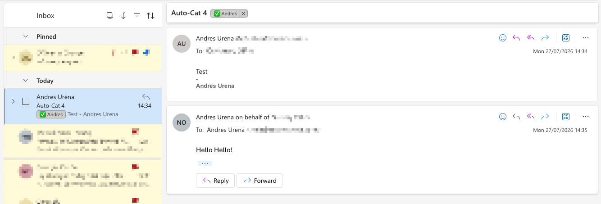
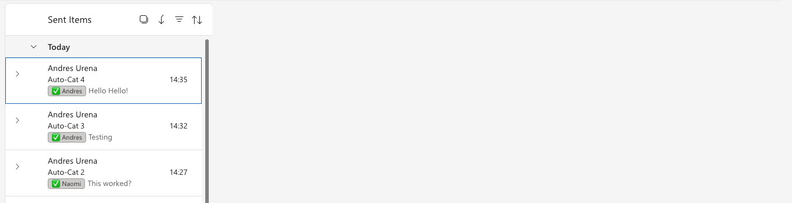

# Auto-tagging shared mailbox replies in Microsoft 365

Crazy enough, you can set up a Shared Mailbox in Microsoft 365... but they won't tell
you who replied to an email unless you use "Send on Behalf" — and even then, nothing
tags it automatically. Everyone just has to remember, or open every message and check.

This isn't just us. It's a recurring complaint — same question, asked independently,
over and over, for more than a decade:

- 2013 — [r/Office365 — "How to track which users have replied to mail sent to a shared mailbox?"](https://www.reddit.com/r/Office365/comments/2v1ww5/how_to_track_which_users_have_replied_to_mail/)
- 2016 — [r/Office365 — "Can we tell which member of shared inbox replied to a message?"](https://www.reddit.com/r/Office365/comments/53pfxe/can_we_tell_which_member_of_shared_inbox_replied/)
- 2018 — [r/vba — "Identifying the actual sender in shared Outlook mailbox"](https://www.reddit.com/r/vba/comments/9rs1yp/identifying_the_actual_sender_in_shared_outlook/) (someone resorted to writing custom VBA just to count replies per person)
- 2023 — [r/Office365 — "Shared inbox category tags & notifications"](https://www.reddit.com/r/Office365/comments/1afk2vq/shared_inbox_category_tags_notifications/)
- 2023 — [r/Outlook — "Is there a way to tell if someone in a shared inbox has taken care of an email"](https://www.reddit.com/r/Outlook/comments/19aqi4r/is_there_a_way_to_tell_if_someone_in_a_shared/)
- 2023 — [r/Office365 — "Is there a way to see who opened a specific email in a shared mailbox?"](https://www.reddit.com/r/Office365/comments/15mpfu6/is_there_a_way_to_see_who_opened_a_specific_email/)
- [Microsoft Q&A — "Identifying who sent an email from a shared mailbox"](https://learn.microsoft.com/en-us/answers/questions/4913451/identifying-who-sent-an-email-from-a-shared-mailbo)

Same core question, three different subreddits, over ten years apart, and the answer
never changed: it isn't natively possible. The accepted "solution" on the Microsoft
Q&A thread is: turn on mailbox auditing, then
run a PowerShell command against the **audit log** any time you want to know who sent
something — and it only works for mail sent *after* you turned auditing on, never
retroactively. That's not "who replied to this," that's "go grep a log file and hope."
The honest, unspoken punchline in threads like these is always the same: *at some point,
just get a proper shared-inbox tool, a helpdesk, or a CRM.* Fair advice if you're a
40-person support team. Overkill if you're a small office with one shared inbox and four
people.

So we built the missing piece ourselves: a small, self-hosted automation that watches a
shared mailbox and **tags every reply with who actually sent it**, in real time, using
things Microsoft 365 already gives you — no new SaaS subscription, no per-seat pricing.

## What it looks like once it's running

The category shows up on the reply itself, and on the original message it was replying
to, so the whole thread is tagged at a glance:



*(Yes, the tag appears at the top of the reading pane too — `Auto-Cat 4  ✅ Alice`.)*



## How it actually works

Two things make this possible, and neither is obvious from the Microsoft 365 UI:

1. **"Send on Behalf" leaves a fingerprint that "Send As" doesn't.** If someone sends a
   message *as* a shared mailbox (Send As), Microsoft Graph reports the sender and the
   mailbox as identical — no way to tell who it really was. But if they send *on behalf
   of* the shared mailbox (Send on Behalf), Graph exposes two separate fields: `sender`
   (the real person) and `from` (the shared mailbox). That difference is the entire
   trick this project relies on.

2. **Microsoft Graph can push you a webhook the instant a new message lands** in a
   folder ("change notifications"), instead of you having to poll. Combine that with the
   sender/from distinction above, and you get: the moment someone replies, you know
   exactly who they were and can tag the message automatically.

The rest is just wiring: a small background service (this repo, deployed as a
[Cloudflare Worker](https://developers.cloudflare.com/workers/) — this would work
equally well as an Azure Function, AWS Lambda, or anything else that can receive a
webhook) that:

- Subscribes to new-message notifications on the shared mailbox's Sent Items folder
- On each notification, checks `sender` vs `from` — if they differ, someone replied
  on-behalf
- Maps the sender's name to a category you've already created in Outlook
- Tags the sent reply, and finds/tags the original message in the same conversation too
- Renews its own subscription daily, forever, with no manual upkeep

No third-party service ever sees your mail — the only two parties involved are your own
Microsoft 365 tenant and your own Cloudflare (or equivalent) account.

## Before you start

You'll need:

- A Microsoft 365 tenant where you're a Global Admin (or have the right delegated roles)
- A shared mailbox already set up, with your team added as members using **Send on
  Behalf**, not Send As (Exchange admin center → Recipients → Mailboxes → shared
  mailbox → Delegation)
- The **"copy items to Sent Items"** option turned on for on-behalf sends on that
  mailbox, otherwise replies never show up anywhere shared
- A set of Outlook **categories** already created in the shared mailbox matching your
  team's names (right-click any message → Categorize → Manage categories, while viewing
  the shared mailbox)
- Somewhere to host a small webhook (this guide uses Cloudflare Workers, which has a
  generous free tier)

## Setup

### 1. Register an app in Microsoft Entra

- Entra admin center → **App registrations** → **New registration**
- Name it whatever you like, e.g. "Mailbox Reply Tagger"
- Account type: **Single tenant** — this app should never work outside your own tenant
- Leave **Redirect URI blank** — this app authenticates as itself in the background
  (client credentials flow), there's no user sign-in step, so no redirect is needed
- Click **Register**

From the app's **Overview** page, note down the **Application (client) ID** and
**Directory (tenant) ID** — you'll need both shortly.

### 2. Grant the one permission it needs

- **API permissions** → **Add a permission** → **Microsoft Graph** →
  **Application permissions** (not Delegated — there's no signed-in user)
- Search for and select **Mail.ReadWrite**
- **Add permissions**, then **Grant admin consent** for your organization

### 3. Create a client secret

- **Certificates & secrets** → **Client secrets** → **New client secret**
- Give it a description and an expiry, then **Add**
- Copy the **Value** immediately — it's shown once. (Don't confuse it with the
  **Secret ID** column next to it — that's a different, non-secret identifier and won't
  authenticate anything.)

### 4. Lock the app down to just this one mailbox

By default, an app with `Mail.ReadWrite` (application permission) can read and write
**every mailbox in your tenant**. You almost certainly don't want that for a
single-purpose background service. Exchange Online has a mechanism for this called an
**Application Access Policy** — it restricts an app to only the mailboxes in a specific
security group.

You'll need [PowerShell](https://learn.microsoft.com/en-us/powershell/scripting/install/installing-powershell)
and the Exchange Online module for this part — **not** Azure PowerShell/Cloud Shell,
which is a different thing entirely and will complain about a missing Azure
subscription if you try. Install what you actually need:

```powershell
Install-Module -Name ExchangeOnlineManagement -Scope CurrentUser
Connect-ExchangeOnline -UserPrincipalName you@example.com
```

Then, replacing the placeholders with your own values:

```powershell
New-DistributionGroup -Name "MailTaggerScope" -Members shared@example.com -Type Security

# Confirm what address the group actually landed on before the next step -
# it may not be on the domain you expect (see "Gotchas" below).
Get-DistributionGroup -Identity "MailTaggerScope" | Select-Object Name, PrimarySmtpAddress

New-ApplicationAccessPolicy `
  -AppId "<your app's Client ID>" `
  -PolicyScopeGroupId "<the PrimarySmtpAddress from above>" `
  -AccessRight RestrictAccess `
  -Description "Restrict mail tagger to one shared mailbox only"
```

Verify it actually took effect before moving on:

```powershell
Test-ApplicationAccessPolicy -AppId "<your app's Client ID>" -Identity shared@example.com
# Expect: AccessCheckResult Granted

Test-ApplicationAccessPolicy -AppId "<your app's Client ID>" -Identity someoneelse@example.com
# Expect: AccessCheckResult Denied
```

Don't skip this check — see the Gotchas section below for a failure mode that looks
like success but isn't.

### 5. Deploy the Worker

Grab [`worker.js`](worker.js) from this repo. Deploy it however you deploy Workers
(dashboard paste, `wrangler deploy`, or the API) to a Cloudflare account of your own.

Set these as **encrypted Secrets** (not plain text) on the Worker:

| Secret | Value |
|---|---|
| `GRAPH_TENANT_ID` | Directory (tenant) ID from step 1 |
| `GRAPH_CLIENT_ID` | Application (client) ID from step 1 |
| `GRAPH_CLIENT_SECRET` | The secret Value from step 3 |
| `GRAPH_CLIENT_STATE` | Any random string you generate yourself (e.g. `openssl rand -hex 24`) — this is a shared secret between you and your own subscription, used to reject spoofed calls to your webhook |

And these as plain text variables:

| Variable | Value |
|---|---|
| `MAILBOX` | Your shared mailbox address, e.g. `shared@example.com` |
| `NOTIFICATION_URL` | The public URL this Worker will be reachable at, e.g. `https://automation.example.com/notifications` |

Then edit the `CATEGORY_MAP` near the top of `worker.js` to match your team's real
names and the category names you created earlier, and redeploy.

### 6. Point a domain at it and turn on logging

Bind a route or custom domain to the Worker matching whatever `NOTIFICATION_URL` you
set above. **Double-check the route pattern is scoped to that specific subdomain**, not
your whole domain, if you're running a real website on the same zone.

Also turn on **Observability / Logs** for the Worker (off by default on Cloudflare) —
you'll want it the first time something doesn't work.

### 7. Create the first subscription

Microsoft Graph subscriptions don't create themselves — visit this once in a browser
(swap in your real domain and the `GRAPH_CLIENT_STATE` value you chose):

```
https://automation.example.com/status?key=<your GRAPH_CLIENT_STATE value>
```

You should get back JSON with `"action": "created"` and `"ok": true`. From here on, a
daily scheduled run inside the Worker keeps renewing it automatically — nothing else to
maintain.

### 8. Test it

Send yourself a throwaway email to the shared mailbox, reply to it *from* the shared
mailbox (making sure it's genuinely selected in the From field), and check both the
reply and the original message a few seconds later.

## Gotchas we hit building this (so you don't have to)

- **Azure PowerShell ≠ Exchange Online PowerShell.** They're two unrelated products.
  If you see an error about having "no Azure subscription" while trying to run Exchange
  commands, you're very likely in Azure Cloud Shell or have the `Az` module loaded by
  mistake. You want the `ExchangeOnlineManagement` module specifically, and it needs no
  Azure subscription at all.
- **A newly created security group might not land on the domain you expect.** If your
  tenant has more than one verified domain, `New-DistributionGroup` can default to your
  `*.onmicrosoft.com` domain rather than your custom one. Always run `Get-DistributionGroup`
  afterwards and use the address it actually gives you, rather than assuming.
- **`Get-ApplicationAccessPolicy` with no arguments throws a bizarre Active Directory
  error** ("object ... couldn't be found on ...") when there are *zero* access policies
  in the tenant, instead of just returning an empty list. If you see this, it usually
  means your `New-ApplicationAccessPolicy` command silently didn't take effect earlier —
  go back and re-run it as one clean single-line command.
- **`Test-ApplicationAccessPolicy` returning `Granted` for every mailbox** usually means
  the policy was never actually created (see above), not that you need to wait for
  propagation. Confirm the policy actually exists with `Get-ApplicationAccessPolicy`
  before assuming it's just a timing issue.
- **Microsoft Graph's `$filter` doesn't support filtering on the `id` property.** If
  you're trying to exclude the current message when looking up the rest of a
  conversation (`... and id ne '...'`), Graph will reject it with `ErrorInvalidProperty`.
  Filter by `conversationId` alone and exclude the current message afterwards, in code.
- **URL-encode your whole `$filter` value.** OData filter expressions contain spaces and
  quotes; building the query string by hand without `encodeURIComponent()` produces a
  malformed request that fails silently before it even reaches Graph.
- **Cloudflare Workers Observability is off by default**, even if the "Logs" sub-setting
  looks enabled. Turn on the top-level toggle before you go looking for logs that were
  never being recorded.
- **Redeploying a Worker can silently wipe secrets you set via the dashboard**, if your
  deploy tooling doesn't know to preserve them. Cloudflare's API has a `keep_bindings`
  option for exactly this — check your tooling supports the equivalent before you
  redeploy and lose working credentials.

## Limitations, honestly

- Only fires when someone actually replies *from* the shared mailbox (on-behalf). If
  they accidentally reply from their own personal address, there's nothing to detect —
  same as today, no worse.
- Tags the *reply*, not the original inbound message directly — they just end up
  threaded together via conversation matching, which is good enough for "who handled
  this" at a glance but isn't a database you can query.
- This is genuinely a workaround, not a platform feature. If your team grows past a
  handful of people or you need assignment, SLAs, or reporting, the "just get a
  helpdesk tool" advice from those Reddit/Q&A threads stops being a joke and starts
  being correct.

## License

MIT — see [LICENSE](LICENSE). Use it, fork it, adapt it.

This isn't an official Microsoft or Cloudflare project, just something we built to solve
our own problem and figured was worth sharing.
